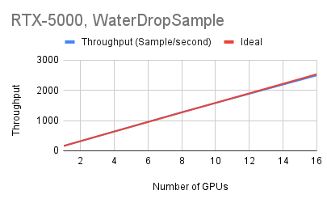
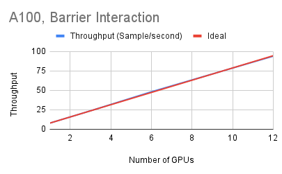

# Graph Network Simulator (GNS) and MeshNet

[](https://zenodo.org/badge/latestdoi/427487727)
[](https://github.com/geoelements/gns/actions/workflows/train.yml)
[](https://ghcr.io/geoelements/gns:gpu)
[](https://raw.githubusercontent.com/geoelements/gns/main/license.md)

> Krishna Kumar, The University of Texas at Austin.
> Joseph Vantassel, Texas Advanced Computing Center, UT Austin.
> Yongjin Choi, The University of Texas at Austin.

Graph Network-based Simulator (GNS) is a generalizable, efficient, and accurate machine learning (ML)-based surrogate simulator for particulate and fluid systems using Graph Neural Networks (GNNs). GNS code is a viable surrogate for numerical methods such as Material Point Method, Smooth Particle Hydrodynamics and Computational Fluid dynamics. GNS exploits distributed data parallelism to achieve fast multi-GPU training. The GNS code can handle complex boundary conditions and multi-material interactions.

MeshNet is a scalable surrogate simulator for any mesh-based models like Finite Element Analysis (FEA), Computational Fluid Dynammics (CFD), and Finite Difference Methods (FDM). 

## Run GNS/MeshNet

> Training GNS/MeshNet on simulation data
```shell
# For particulate domain,
python3 -m gns.train mode="train" --config-path ./ --config-name config.yaml
# For mesh-based domain,
python3 -m meshnet.train mode="train" --config-path ./ --config-name config_mesh.yaml
```

> Resume training

To resume training specify `model_file` and `train_state_file`:

```shell
# For particulate domain,
python3 -m gns.train mode="train" training.resume=True
# For mesh-based domain,
python3 -m meshnet.train mode="train" training.resume=True
```

> Rollout prediction
```shell
# For particulate domain,
python3 -m gns.train mode="rollout"
# For mesh-based domain,
python3 -m meshnet.train mode="rollout"
```

> Render
```shell
# For particulate domain,
python3 -m gns.render_rollout --output_mode="gif" --rollout_dir="<path-containing-rollout-file>" --rollout_name="<name-of-rollout-file>"
# For mesh-based domain,
python3 -m gns.render --rollout_dir="<path-containing-rollout-file>" --rollout_name="<name-of-rollout-file>"
```

In particulate domain, the renderer also writes `.vtu` files to visualize in ParaView.


> GNS prediction of Sand rollout after training for 2 million steps.

In mesh-based domain, the renderer writes `.gif` animation.


> Meshnet GNS prediction of cylinder flow after training for 1 million steps.


## Configuration file
<details>
<summary>GNS (particulate domain) </summary>

```yaml
defaults:
  - _self_
  - override hydra/hydra_logging: disabled  
  - override hydra/job_logging: disabled  

hydra:
  output_subdir: null  
  run:
    dir: .

# Top-level configuration
mode: train

# Data configuration
data:
  path: ../gns-sample/WaterDropSample/dataset/
  batch_size: 2
  noise_std: 6.7e-4
  input_sequence_length: 6
  num_particle_types: 9
  kinematic_particle_id: 3

# Model configuration
model:
  path: ../gns-sample/WaterDropSample/models/
  file: null
  train_state_file: null

# Output configuration
output:
  path: ../gns-sample/WaterDropSample/rollouts/
  filename: rollout

# Training configuration
training:
  steps: 2000
  validation_interval: null
  save_steps: 500
  resume: False
  learning_rate:
    initial: 1e-4
    decay: 0.1
    decay_steps: 50000

# Hardware configuration
hardware:
  cuda_device_number: null
  n_gpus: 1

# Logging configuration
logging:
  tensorboard_dir: logs/
```

</details>


<details>
<summary>`train.py` in MeshNet (mesh-based domain) </summary>

**mode (String)**

This flag is used to set the operation mode for the script. It can take one of three values; 'train', 'valid', or 'rollout'.

**batch_size (Integer)** 

Batch size for training.

**data_path (String)**

Specifies the directory path where the dataset is located. 
The dataset is expected to be in a specific format (e.g., .npz files).
If `--mode` is training, the directory should contain `train.npz`.
If `--mode` is testing (rollout), the directory should contain `test.npz`.
If `--mode` is valid, the directory should contain `valid.npz`.

**model_path (String)** 

The directory path where the trained model checkpoints are saved during training or loaded from during validation/rollout.

**output_path (String)**

Defines the directory where the outputs (e.g., rollouts) are saved, 
when the `--mode` is set to rollout.
This is particularly relevant in the rollout mode where the predictions of the model are stored.

**model_file (String)**

The filename of the model checkpoint to load for validation or rollout (e.g., model-10000.pt). 
It supports a special value "latest" to automatically select the newest checkpoint file. 
This flexibility facilitates the evaluation of models at different stages of training.

**train_state_file (String)**

Similar to model_file, but for loading the training state (e.g., optimizer state).
It supports a special value "latest" to automatically select the newest checkpoint file. 
(e.g., training_state-10000.pt)

**cuda_device_number (Integer)**

Allows specifying a particular CUDA device for training or evaluation, enabling the use of specific GPUs in multi-GPU setups.

**rollout_filename (String)**

Base name for saving rollout files. The actual filenames will append an index to this base name.

**ntraining_steps (Integer)**

The total number of training steps to execute before stopping.

**nsave_steps (Integer)**

Interval at which the model and training state are saved.

</details>

## Datasets
### Particulate domain:
We use the numpy `.npz` format for storing positional data for GNS training.  The `.npz` format includes a list of tuples of arbitrary length where each tuple corresponds to a differenet training trajectory and is of the form `(position, particle_type)`.  The data loader provides `INPUT_SEQUENCE_LENGTH` positions, set equal to six by default, to provide the GNS with the last `INPUT_SEQUENCE_LENGTH` minus one positions as input to predict the position at the next time step.  The `position` is a 3-D tensor of shape `(n_time_steps, n_particles, n_dimensions)` and `particle_type` is a 1-D tensor of shape `(n_particles)`.  

The dataset contains:

* Metadata file with dataset information `(sequence length, dimensionality, box bounds, default connectivity radius, statistics for normalization, ...)`:

```
{
  "bounds": [[0.1, 0.9], [0.1, 0.9]], 
  "sequence_length": 320, 
  "default_connectivity_radius": 0.015, 
  "dim": 2, 
  "dt": 0.0025, 
  "vel_mean": [5.123277536458455e-06, -0.0009965205918140803], 
  "vel_std": [0.0021978993231675805, 0.0026653552458701774], 
  "acc_mean": [5.237611158734309e-07, 2.3633027988858656e-07], 
  "acc_std": [0.0002582944917306106, 0.00029554531667679154]
}
```
* npz containing data for all trajectories `(particle types, positions, global context, ...)`:

Training datasets for Sand, SandRamps, and WaterDropSample are available on [DesignSafe Data Depot](https://www.designsafe-ci.org/data/browser/public/designsafe.storage.published/PRJ-3702) [@vantassel2022gnsdata].

We provide the following datasets:
  * `WaterDropSample` (smallest dataset)
  * `Sand`
  * `SandRamps`

Download the dataset [DesignSafe DataDepot](https://doi.org/10.17603/ds2-0phb-dg64). If you are using this dataset please cite [Vantassel and Kumar., 2022](https://github.com/geoelements/gns#dataset)

### Mesh-based domain:
We also use the numpy `.npz` format for storing data for training meshnet GNS.

The dataset contains:
* npz containing python dictionary describing mesh data and relevant dynamics at mesh nodes for all trajectories. The dictionary includes `{pos: (ntimestep, nnodes, ndims), node_type: (ntimestep, nnodes, ntypes), velocity: (ntimestep, nnodes, ndims), pressure: (ntimestep, nnodes, 1), cells: (ntimestep, ncells, 3)}`

The dataset is shared on [DesignSafe DataDepot](https://doi.org/10.17603/ds2-fzg7-1719). If you are using this dataset please cite [Kumar and Choi., 2023](https://github.com/geoelements/gns#dataset)

## Installation

GNS uses [pytorch geometric](https://www.pyg.org/) and [CUDA](https://developer.nvidia.com/cuda-downloads). These packages have specific requirements, please see [PyG installation]((https://pytorch-geometric.readthedocs.io/en/latest/notes/installation.html) for details. 

> CPU-only installation on Linux/MacOS

```shell
pip3 install torch torchvision torchaudio --index-url https://download.pytorch.org/whl/cpu
pip3 install torch_geometric
pip3 install pyg_lib torch_scatter torch_sparse torch_cluster torch_spline_conv -f https://data.pyg.org/whl/torch-2.3.0+cpu.html
pip3 install -r requirements.txt
```

To test the code you can run:

```
pytest test/
```

### Build Docker Image

Dockerfile-GPU is supplied to build image with GPU support.

```
docker pull ghcr.io/geoelements/gns:gpu
```


## GNS training in parallel
GNS can be trained in parallel on multiple nodes with multiple GPUs.

### GNS Scaling results

> GNS scaling results on [TACC Frontera GPU nodes](https://docs.tacc.utexas.edu/hpc/frontera/#table3) with RTX-5000 GPUs.


> GNS scaling result on [TACC lonestar6 GPU nodes](https://docs.tacc.utexas.edu/hpc/lonestar6/#table2) with A100 GPUs.

### Usage

```shell
mpiexec.hydra -np $NNODES -ppn 1 ../slurm_scripts/launch_helper.sh $DOCKER_IMG_LOCATION $n_gpu_per_node
```


### Inspiration
PyTorch version of Graph Network Simulator and Mesh Graph Network Simulator are based on:
* [https://arxiv.org/abs/2002.09405](https://arxiv.org/abs/2002.09405) and [https://github.com/deepmind/deepmind-research/tree/master/learning_to_simulate](https://github.com/deepmind/deepmind-research/tree/master/learning_to_simulate)
* [https://arxiv.org/abs/2010.03409](https://arxiv.org/abs/2002.09405) and [https://github.com/deepmind/deepmind-research/tree/master/meshgraphnets](https://github.com/deepmind/deepmind-research/tree/master/meshgraphnets)
* [https://github.com/echowve/meshGraphNets_pytorch](https://github.com/echowve/meshGraphNets_pytorch)

### Acknowledgement
This code is based upon work supported by the National Science Foundation under Grant OAC-2103937.

### Citation

#### Repo
Kumar, K., & Vantassel, J. (2023). GNS: A generalizable Graph Neural Network-based simulator for particulate and fluid modeling. Journal of Open Source Software, 8(88), 5025. https://doi.org/10.21105/joss.05025

#### Dataset
* Vantassel, Joseph; Kumar, Krishna (2022) “Graph Network Simulator Datasets.” DesignSafe-CI. https://doi.org/10.17603/ds2-0phb-dg64 v1 
* Kumar, K., Y. Choi. (2023) "Cylinder flow with graph neural network-based simulator." DesignSafe-CI. https://doi.org/10.17603/ds2-fzg7-1719

