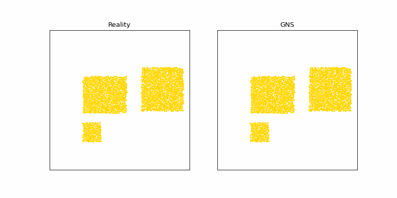

# Graph Network Simulator (GNS) and MeshNet

[](https://zenodo.org/badge/latestdoi/427487727)
[](https://dl.circleci.com/status-badge/redirect/gh/geoelements/gns/tree/main)
[](https://quay.io/repository/geoelements/gns)
[](https://raw.githubusercontent.com/geoelements/gns/main/license.md)

> Krishna Kumar, The University of Texas at Austin.
> Joseph Vantassel, Texas Advanced Computing Center, UT Austin.
> Yongjin Choi, The University of Texas at Austin.
> Sikan Li, Texas Advanced Computing Center, UT Austin.

Graph Network-based Simulator (GNS) is a generalizable, efficient, and accurate machine learning (ML)-based surrogate simulator for particulate and fluid systems using Graph Neural Networks (GNNs). GNS code is a viable surrogate for numerical methods such as Material Point Method, Smooth Particle Hydrodynamics and Computational Fluid dynamics. GNS exploits distributed data parallelism to achieve fast multi-GPU training. The GNS code can handle complex boundary conditions and multi-material interactions.


## Run GNS

> Training GNS on simulation data

On each node, run

```shell
python -m torch.distributed.launch --nnodes=[NNODES]  --nproc_per_node=[GPU_PER_NODE] --node_rank=[LOCAL_RANK] --master_addr=[MAIN_RANK ]gns/train_kan.py [ARGS] 
```

> Resume training

To resume training specify `model_file` and `train_state_file`:

On each node, run

```shell
python -m torch.distributed.launch  --data_path="<input-training-data-path>" --model_path="<path-to-load-save-model-file>" --output_path="<path-to-save-output>"  --model_file="model.pt" --train_state_file="train_state.pt" --ntraining_steps=100
```

> Rollout prediction
```shell
torchrun --standalone --nproc_per_node 1 gns/train_kan.py  
--mode="rollout" ---data_path="<input-data-path>" --model_path="<path-to-load-save-model-file>" --output_path="<path-to-save-output>" --model_file="model.pt" --train_state_file="train_state.pt" [ARGS] 
```

> Render
```shell
python3 -m gns.render_rollout --output_mode="gif" --rollout_dir="<path-containing-rollout-file>" --rollout_name="<name-of-rollout-file>"
```



> GNS prediction of Sand rollout after training for 2 million steps.

## Command line arguments details
<details>
<summary>`train_kan.py` in GNS </summary>

**mode (Enum)** 

This flag is used to set the operation mode for the script. It can take one of three values; 'train', 'valid', or 'rollout'.

**use_kan (0 or 1)**

Set this flag to 1 if you choose a model with KAN, or 0 if you choose a model with MLP.

**latent_dim (Integer)**

Latent dimention of the model.

**nmlp_layers (Integer)**

Number of MLP embedding layers.

**mlp_hidden_dim (Integer)**

Hidden dimention for MLP layers.

**batch_size (Integer)**

Batch size for training.

**noise_std (Float)** 

Standard deviation of the noise when training.

**data_path (String)** 

Specifies the directory path where the dataset is located. 
The dataset is expected to be in a specific format (e.g., .npz files).
It should contain `metadata.json`.
If `--mode` is training, the directory should contain `train.npz`.
If `--mode` is testing (rollout), the directory should contain `test.npz`.
If `--mode` is valid, the directory should contain `valid.npz`.

**model_path (String)** 

The directory path where the trained model checkpoints are saved during training or loaded from during validation/rollout.

**output_path (String)** 

Defines the directory where the outputs (e.g., rollouts) are saved, 
when the `--mode` is set to rollout.
This is particularly relevant in the rollout mode where the predictions of the model are stored.

**output_filename (String)** 

Base filename to use when saving outputs during rollout.
Default is "rollout", and the output will be saved as `rollout.pkl` in `output_path`. 
It is not intended to include the file extension.

**model_file (String)** 

The filename of the model checkpoint to load for validation or rollout (e.g., model-10000.pt). 
It supports a special value "latest" to automatically select the newest checkpoint file. 
This flexibility facilitates the evaluation of models at different stages of training.

**train_state_file (String)** 

Similar to model_file, but for loading the training state (e.g., optimizer state).
It supports a special value "latest" to automatically select the newest checkpoint file. 
(e.g., training_state-10000.pt)

**ntraining_steps (Integer)** 

The total number of training steps to execute before stopping.

**nsave_steps (Integer)** 

Interval at which the model and training state are saved.

**lr_init (Float)** 

Initial learning rate.

**lr_decay (Float)** 

How much the learning rate should decay over time.

**lr_decay_steps (Integer)** 

Steps at which learning rate should decay.

**cuda_device_number (Integer)** 

Base CUDA device (zero indexed).
Default is None so default CUDA device will be used.

**n_gpus (Integer)** 

Number of GPUs to use for training.
</details>


## Datasets
We use the numpy `.npz` format for storing positional data for GNS training.  The `.npz` format includes a list of tuples of arbitrary length where each tuple corresponds to a differenet training trajectory and is of the form `(position, particle_type)`.  The data loader provides `INPUT_SEQUENCE_LENGTH` positions, set equal to six by default, to provide the GNS with the last `INPUT_SEQUENCE_LENGTH` minus one positions as input to predict the position at the next time step.  The `position` is a 3-D tensor of shape `(n_time_steps, n_particles, n_dimensions)` and `particle_type` is a 1-D tensor of shape `(n_particles)`.  

The dataset contains:

* Metadata file with dataset information `(sequence length, dimensionality, box bounds, default connectivity radius, statistics for normalization, ...)`:

```
{
  "bounds": [[0.1, 0.9], [0.1, 0.9]], 
  "sequence_length": 320, 
  "default_connectivity_radius": 0.015, 
  "dim": 2, 
  "dt": 0.0025, 
  "vel_mean": [5.123277536458455e-06, -0.0009965205918140803], 
  "vel_std": [0.0021978993231675805, 0.0026653552458701774], 
  "acc_mean": [5.237611158734309e-07, 2.3633027988858656e-07], 
  "acc_std": [0.0002582944917306106, 0.00029554531667679154]
}
```
* npz containing data for all trajectories `(particle types, positions, global context, ...)`:

Training datasets for Sand, SandRamps, and WaterDropSample are available on [DesignSafe Data Depot](https://www.designsafe-ci.org/data/browser/public/designsafe.storage.published/PRJ-3702) [@vantassel2022gnsdata].

We provide the following datasets:
  * `WaterDropSample` (smallest dataset)
  * `Sand`
  * `SandRamps`

Download the dataset [DesignSafe DataDepot](https://doi.org/10.17603/ds2-0phb-dg64). If you are using this dataset please cite [Vantassel and Kumar., 2022](https://github.com/geoelements/gns#dataset)

## Installation
### Pulling GNS container 

docker pull skyeglitch/gns-test

### Inspiration
PyTorch version of Graph Network Simulator and Mesh Graph Network Simulator are based on:
* [https://arxiv.org/abs/2002.09405](https://arxiv.org/abs/2002.09405) and [https://github.com/deepmind/deepmind-research/tree/master/learning_to_simulate](https://github.com/deepmind/deepmind-research/tree/master/learning_to_simulate)
* [https://arxiv.org/abs/2010.03409](https://arxiv.org/abs/2002.09405) and [https://github.com/deepmind/deepmind-research/tree/master/meshgraphnets](https://github.com/deepmind/deepmind-research/tree/master/meshgraphnets)
* [https://github.com/echowve/meshGraphNets_pytorch](https://github.com/echowve/meshGraphNets_pytorch)


GNS uses [pytorch geometric](https://www.pyg.org/) and [CUDA](https://developer.nvidia.com/cuda-downloads). These packages have specific requirements, please see [PyG installation]((https://pytorch-geometric.readthedocs.io/en/latest/notes/installation.html) for details. 


There is [slurm script](slurm_scripts/train_parallel_multinode_push.sh) available in the repo if you would like to test to code on TACC's Lonestar6 A100 nodes.
To test on the small waterdroplet sample:

```
git clone https://github.com/geoelements/gns-sample
git checkout kan-gns

TMP_DIR="./gns-sample"
DATASET_NAME="WaterDropSample"

mkdir -p ${TMP_DIR}/${DATASET_NAME}/models/
mkdir -p ${TMP_DIR}/${DATASET_NAME}/rollout/

DATA_PATH="${TMP_DIR}/${DATASET_NAME}/dataset/"
MODEL_PATH="${TMP_DIR}/${DATASET_NAME}/models/"
ROLLOUT_PATH="${TMP_DIR}/${DATASET_NAME}/rollout/"

sbatch slurm_scripts/train_parallel_multinode_push.sh
```


### Acknowledgement
This code is based upon work supported by the National Science Foundation under Grant OAC-2103937.

### Citation

#### Repo
Kumar, K., & Vantassel, J. (2023). GNS: A generalizable Graph Neural Network-based simulator for particulate and fluid modeling. Journal of Open Source Software, 8(88), 5025. https://doi.org/10.21105/joss.05025

#### Dataset
* Vantassel, Joseph; Kumar, Krishna (2022) “Graph Network Simulator Datasets.” DesignSafe-CI. https://doi.org/10.17603/ds2-0phb-dg64 v1 
* Kumar, K., Y. Choi. (2023) "Cylinder flow with graph neural network-based simulator." DesignSafe-CI. https://doi.org/10.17603/ds2-fzg7-1719

