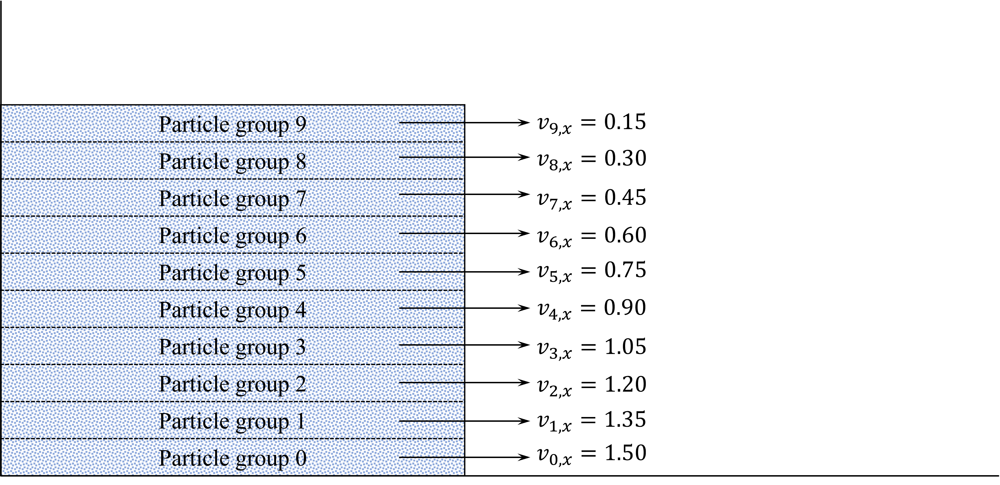
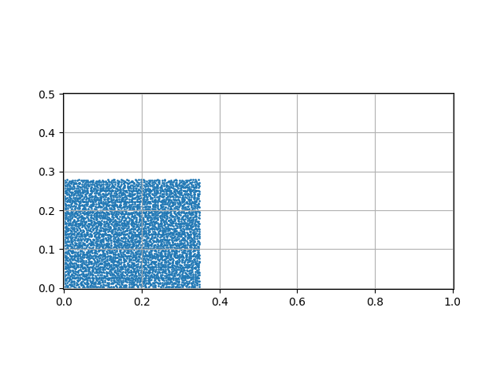
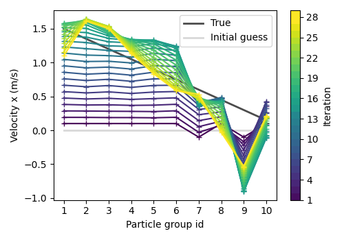
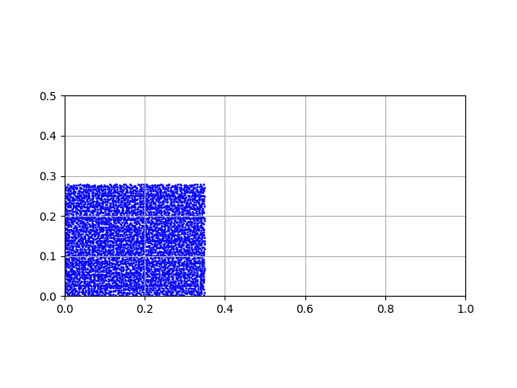

# Solving Inverse Problem in Granular Flow Using GNS
This example shows an example for solving inverse problem in granular flow using GNS. 
The example uses the gradient-based optimization method using 
the fully differential nature of GNS and automatic differentiation (AD).

## Problem Statement

Consider the multi-layered granular column which has different initial velocity for each layer
(see the figure below).



The ground truth simulation result of the above configuration 
using material point method (MPM) is as follows.



The objective of the inverse problem in this example is to estimate the initial velocity 
of each layer only with the information about the final deposit for the last few timesteps.

## Data
### Download link
The necessary data for this example can be downloaded [here](https://utexas.box.com/s/i4x1n1gzb7r27ccfqr963xpzc3jtxe59).
 
### Description
* `particle_group.txt`: Particle coordinate information for each layer
* `model.pt`: GNS simulator
* `gns_metadata.json`: Configuration file for GNS simulator
* `mpm_input.json`: Information about ground truth simulation (MPM)

By default configuration, it is recommended to store the above files under `./data` directory.  

### Configuration file
```toml
# Top-level entries
path = "data/"

# Optimization sub-table
[optimization]
nepoch = 30
inverse_timestep_range = [300, 380]
checkpoint_interval = 1
lr = 0.1
initial_velocities = [[0.0], [0.0], [0.0], [0.0], [0.0], [0.0], [0.0], [0.0], [0.0], [0.0]]

# Ground Truth sub-table
[ground_truth]
ground_truth_npz = "sand2d_inverse_eval30.npz"
ground_truth_mpm_inputfile = "mpm_input.json"

# Forward Simulator sub-table
[forward_simulator]
dt_mpm = 0.0025
model_path = "data/"
model_file = "model.pt"
simulator_metadata_path = "data/"
simulator_metadata_file = "gns_metadata.json"

# Resume sub-table
[resume]
resume = false
epoch = 1

# Output sub-table
[output]
output_dir = "data/outputs/"
save_step = 1
```

## Core Features
### Gradient checkpoint
The downside of using AD is that it requires a significant amount of memory for 
large-scale neural networks because it retains all the activations for 
all the intermediate layers during the backpropagation. 
Since GNS computes $\boldsymbol{X}_t\rightarrow \boldsymbol{X}_{t+1}$ using multiple MLPs 
between the large number of edges, and the entire simulation even entails the accumulation of GNS
$\boldsymbol{X}_t\rightarrow \boldsymbol{X}_{t+1}$ for $k$ steps, 
computing gradients requires extensive memory capacity. 

To mitigate this issue, we employ gradient checkpointing as an effective solution. 
This technique allows us to significantly reduce memory consumption by selectively storing 
only certain intermediate activations during the forward pass, 
and then recomputing the omitted values as needed during the backward pass. 
This enables substantial memory savings, so we can conduct backpropagation 
at the desired timestep $k$.


### Resume
The code returns the optimization status with the specified step interval.
By taking the optimization status as the input, we can resume the optimization from the 
previous state.

## Result

The optimization result for the velocities are as follows. As the iteration increases, 
the velocity profile becomes simular to the true value (black line).



The GNS simulation result with the estimated velocity values at `iteration=29` is as follows.
The result shows a good agreement with the ground truth simulation.



