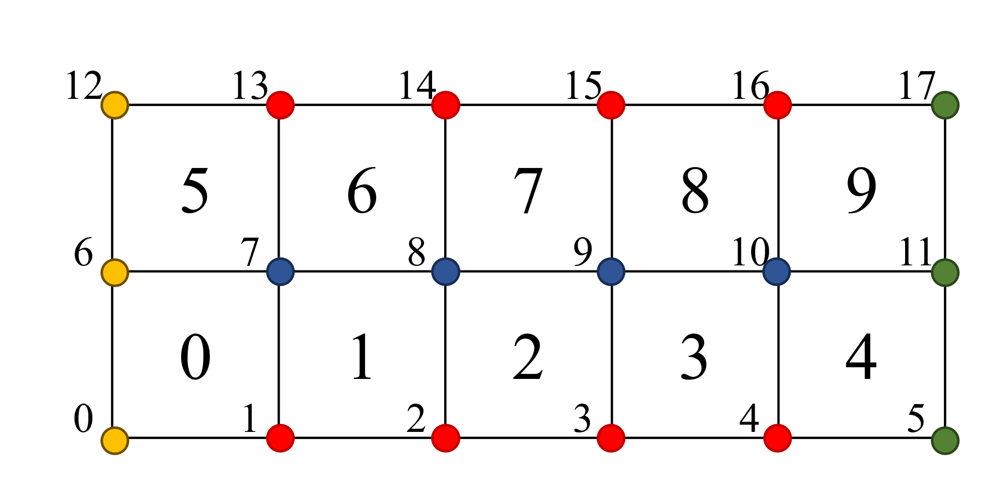
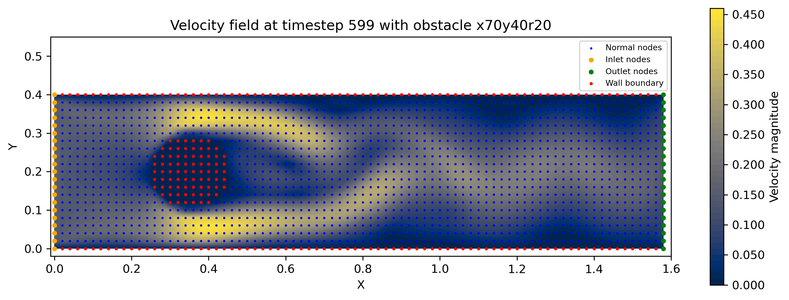

# Flow Data
We use the numpy `.npz` format for storing data for training meshnet GNS.

The dataset contains:
* `.npz` containing python dictionary describing mesh data and relevant 
dynamics at mesh nodes for each simulation. 
The dictionary (`simulation_data`) includes:

```python
simulation_data = {
    "simulation_0": {
        pos: (ntimestep, nnodes, ndims),
        node_type: (ntimestep, nnodes, 1),
        velocity: (ntimestep, nnodes, ndims),
        cells: (ntimestep, ncells, nnodes_per_cell),
        pressure: (ntimestep, nnodes, 1),
    },
    "simulation_1": {
        ...
    },
    "simulation_n": {
        ...
    }
}
```

## `pos`
`pos` contains a numpy array that describes positions of mesh nodes for each 
timesteps with `shape=(ntimestep, nnodes, ndims)`. If the position of 
the nodes does not change over time, the model can accept `shape=(1, nnodes, ndims)`, 
since the x and y coordinate of nodes will be the same for all timestep. 

Consider the mesh example in Figure 1. There are 18 nodes. The `pos` looks like follows given that the simulation timestep is 100. This is an optimization to save memory space when the mesh is static.

```python
array([[[px0_t0, py0_t0],  # at t=0
        [px1_t0, py1_t0],
        ...,
        [px16_t0, py16_t0],
        [px17_t0, py17_t0]],
       [[px0_t1, py0_t1],  # at t=1
        [px1_t1, py1_t1],
        ...,
        [px16_t1, py16_t1]
        [px17_t1, py17_t1]],
       
       ...

       [[px0_t99, py0_t99],  # at t=99
        [px1_t99, py1_t99],
        ...,
        [px16_t99, py16_t99]
        [px17_t99, py17_t99]]], shape=(100, 18, 2))
```


## `node_type`
`node_type` contains a numpy array that describes whether a node is one of the following types:

* Normal nodes (=0)
* Inlet nodes (=4)
* Outlet nodes (=5)
* Wall boundary nodes (=6)

These node types are assigned to the corresponding nodes with the same index used for `pos` array. If the node type changes over time, the shape is `shape=(ntimestep, nnodes, 1)`. Otherwise, `shape=(1, nnodes, 1)` as we did the same in `pos`.

In our example (figure 1), `node_type` looks like follows:
```python
array([[[4],  # at t=0
        [6],
        [6],
        [6],
        [6],
        [5],
        [4],
        [0],
        [0],
        [0],
        [0],
        [5],
        [4],
        [6],
        [6],
        [6],
        [6],
        [5]],
       
       ...
           
       [[4],  # at t=99
        [6],
        [6],
        ...,
        [6],
        [6],
        [5]]], shape=(100, 18, 1))
```

## `velocity`
`velocity` contains the velocity information at each timestep with shape = `shape=(ntimestep, nnodes, ndims)`. The index of the array should follow what is defined in `pos`.

In our example, 
```python
array([[[vx0_t0, vy0_t0],  # at t=0
        [vx1_t0, vy1_t0],
        ...,
        [vx6_t0, vy16_t0],
        [vx7_t0, vy17_t0]],
       [[vx_t1, vy0_t1],  # at t=1
        [vx_t1, vy1_t1],
        ...,
        [vx16_t1, vy16_t1]
        [vx17_t1, vy17_t1]],
       
       ...

       [[vx0_t99, vy0_t99],  # at t=99
        [vx1_t99, vy1_t99],
        ...,
        [vx16_t99, vy16_t99]
        [vx17_t99, vy17_t99]]], shape=(100, 18, 2))
```

## `cells`
`cells` contains a numpy array that defines the group of node indices that constructs a cell. 

In our example, `cells` array looks like,
```python
array([[[0, 1, 7, 6],  # at t=0
        [1, 2, 8, 7],
        ...,
        [9, 10, 16, 15],
        [10, 11, 17, 16]],
       
       ...
           
       [[0, 1, 7, 6],  # at t=99
        [1, 2, 8, 7],
        ...,
        [9, 10, 16, 15],
        [10, 11, 17, 16]]], shape=(100, 10, 4))
```

## Additional Data (optional)
If one wish to construct additional features, the feature like `pressure` can be added.

## Example

*Figure 1. An example mesh. There are time independent 18 nodes and 10 cells. The yellow nodes are inlet nodes (`node_type=4`), red nodes are wall nodes (`node_type=6`), blue nodes are normal  nodes (`node_type=0`), and green nodes (`node_type=5`) are outlet nodes.*


*Figure 2. An example for full simulation.*

## Save and load
Once the python dictionary is ready, the following lines saves the entire dictionary in a compressed format (`.npz`).
```python
import numpy as np
np.savez_compressed("npz_data.npz", **simulation_data)
```

To load data, 
```python
data_train = [dict(sim_info.item()) for sim_info in np.load("npz_data.npz", allow_pickle=True).values()]
```