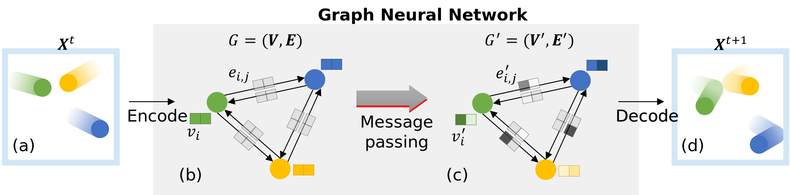
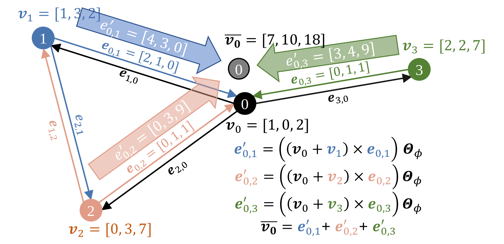
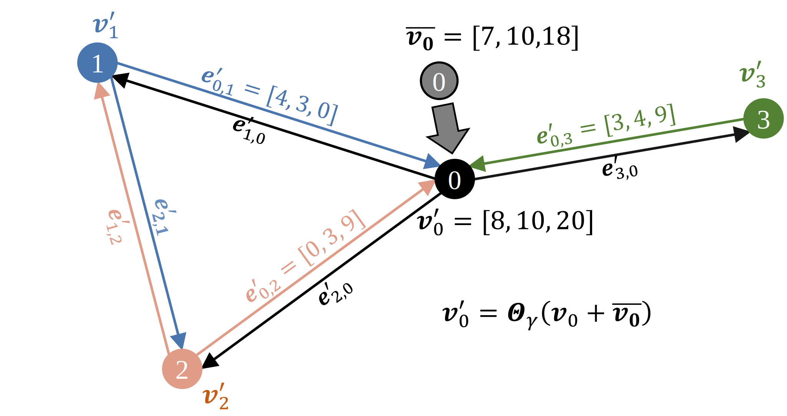
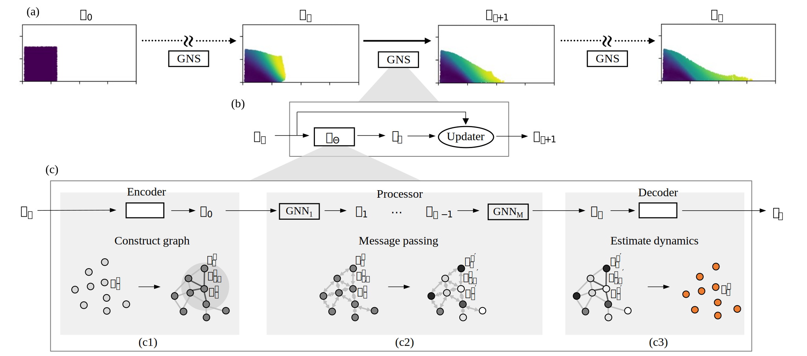

# Method

## Graph Neural Networks (GNNs) and message passing

### Graphs
Graphs are powerful means of representing interactions between physical systems. 
A granular material media can be represented as a graph $ G=\left(V,E\right) $ consisting of a set of vertices ($\bm{v}_i \in\ V$) representing the soil grains and edges ($\bm{e}_{i,j} \in\ E$) connecting a pair of vertices ($\bm{v}_i$ and $\bm{v}_j$) representing the interaction relationship between grains. 
We describe how graphs work by showing a simple example involving interaction between balls in a box (Figure 1a). 
The state of the physical system (Figure 1a and 1d) can be encoded as a graph (Figure 1b and 1c). The vertices describe the balls, and the edges describe the directional interaction between them, shown as arrows in Figure 1b and 1c. 
The state of the ball i is represented as a vertex feature vector $\bm{v}_i$ at $i$. The feature vector includes properties such as velocities, mass, and distance to the boundary. 
The edge feature vector $\bm{e}_{i,j}$ includes the information about the interaction between balls $i$ and $j$ such as the relative distance between the balls.

Graphs offer a permutation invariant form of encoding data, where the interaction between vertices is independent of the order of vertices or their position in Euclidean space. 
Rather,  graphs represent the interactions through the edge connection, not affected by the permutation of the vertices. 
Therefore, graphs can efficiently represent the physical state of granular flow where numerous orderless particles interact by using vertices to represent particles and edges to their interaction. 

### Graph neural networks (GNNs)
GNNs are a state-of-the-art deep learning architecture that can operate on a graph and learn the local interactions. 
GNNs take a graph $G=\left(\bm{V},\bm{E}\right)$ at time t as an input, compute properties and propagate information through the network, termed as message passing, and output an updated graph $G^\prime=\left(\bm{V}^\prime,\bm{E}^\prime\right)$ with an identical structure, where $\bm{V}^\prime$ and $\bm{E}^\prime$ are the set of updated vertex and edge features ($\bm{v}_i^\prime$ and $\bm{e}_{i,\ j}^\prime$).
In the balls-in-a-box example, the GNN first takes the original graph $G=\left(\bm{V},\bm{E}\right)$  (Figure 1b) that describes the current state of the physical system ($\bm{X}^t$). 
The GNN then updates the state of the physical system through message passing, which models the exchange of energy and momentum between the balls communicating through the edges, and returns an updated graph $G^\prime=\left(\bm{V}^\prime,\bm{E}^\prime\right)$ (Figure 1c). 
After the GNN computation, we may decode G^\prime to extract useful information related to the future state of the physical system ($\bm{X}^{t+1}$) such as the next position or acceleration of the balls (Figure 1d).

*Figure. 1. An example of a graph and graph neural network (GNN) that process the graph (modified from Battaglia et al. (2018)): 
(a) A state of the current physical system ($\bm{X}^t$) where the balls are bouncing in a box boundary; 
(b) Graph representation of the physical system ($G$). 
There are three vertices representing balls and six edges representing their directional interaction shown as arrows; 
(c) The updated graph ($G^\prime$) that GNN outputs through message passing; (d) The predicted future state of the physical system ($\bm{X}^{t+1}$) (i.e., the positions of the balls at the next timestep) decoded from the updated graph.*

### Message passing
Message passing consists of three operations: message construction (Eq. 1), message aggregation (Eq. 2), and the vertex update function (Eq. 3). 

$$ 
\begin{equation} 
    \bm{e}_{i,j}^\prime=\phi_{\bm{\Theta}_\phi}\left(\bm{v}_i,\bm{v}_j,\bm{e}_{i,\ j}\right)
\end{equation}
$$

$$ 
\begin{equation} 
    {\bar{\bm{v}}}_i=\Sigma_{j \in N\left(i\right)}\ \bm{e}_{i,j}^\prime
\end{equation}
$$

$$ 
\begin{equation} 
    \bm{v}_i^\prime=\gamma_{\bm{\Theta}_\gamma}\left(\bm{v}_i,{\bar{\bm{v}}}_i\right)
\end{equation}
$$

The subscript $\bm{\Theta}_\phi$ and $\bm{\Theta}_\gamma$ represent a set of learnable parameters in each computation. 
The message construction function $\phi_{\Theta_{\phi}}$ (Eq. 1) takes the feature vector of the receiver and sender vertices ($\bm{v}_i$ and $\bm{v}_j$) and the feature vector of the edge connecting them ($\bm{e}_{i,\ j}$) and returns an updated edge feature vector $\bm{e}_{i,j}^\prime$ as the output. 
$\phi_{\Theta_{\phi}}$ is a matrix operation including the learnable parameter $\bm{\Theta}_\phi$. 
The updated edge feature vector $\bm{e}_{i,j}^\prime$ is the message sent from vertex $j$ to $i$. 
Figure 2a shows an example of constructing messages on edges directing to vertex 0 originating from vertices 1, 2, and 3 ($\bm{e}_{0,1}^\prime, \bm{e}_{0,2}^\prime, \bm{e}_{0,3}^\prime$). 
Here, we define the message construction function $\phi_{\Theta_{\phi}}$ as $\left(\left(\bm{v}_i+\bm{v}_j\right)\times\bm{e}_{i,j}\right)\times\bm{\Theta}_\phi$. 
The updated feature vector $\bm{e}_{0,\ 1}^\prime$ is computed as $\left(\left(\bm{v}_0+\bm{v}_1\right)\times\bm{e}_{0,1}\right)\times\bm{\Theta}_\phi$, where $\bm{v}_0$ and $\bm{v}_1$ are the receiver and sender vertex feature vectors, and $\bm{e}_{0,1}$ is their edge feature vector. 
If we assume that all values of $\bm{\Theta}_\phi$ are 1.0 for simplicity, we obtain $\bm{e}_{0,\ 1}^\prime=(\left(\left[1,\ 0,\ 2\right]\right)+\left[1,\ 3,\ 2\right])\times\left[2,\ 1,\ 0\right]^T)\times1=[4,\ 3,\ 0]$. 
Similarly, we compute the messages $\bm{e}_{0,\ 2}^\prime=\left[0,\ 3,\ 9\right]$ and $\bm{e}_{0,\ 3}^\prime=\left[3,\ 4,\ 9\right]$. 

The next step in message passing is the message aggregation $\Sigma_{j \in N\left(i\right)}$ (Eq. 2), where $N\left(i\right)$ is the set of sender vertices j related to vertex $i$. 
It collects all the messages directing to vertex $i$ and aggregates those into a single vector with the same dimension as the aggregated message (${\bar{\bm{v}}}_i$). 
The aggregation rule can be element-wise vector summation or averaging, hence it is a permutation invariant computation. 
In Figure 2a, the aggregated message $\bar{\bm{v}_0}=\left[7,10,18\right]$ is the element-wise summation of the messages directing to vertex 0 as $\bar{\bm{v}_o}=\bm{e}_{0,\ 1}^\prime+\ \bm{e}_{0,\ 2}^\prime+\ \bm{e}_{0,\ 3}^\prime$. 

The final step of the message passing is updating vertex features using Eq. 3. 
It takes the aggregated message (${\bar{\bm{v}}}_i$) and the current vertex feature vector $\bm{v}_i$, and returns an updated vertex feature vector $\bm{v}_i^\prime$, using predefined vector operations including the learnable parameter $\bm{\Theta}_\gamma$. Figure 2b shows an example of the update at vertex 0. 
Here, we define the update function $\gamma_{\Theta_{\gamma}}$ as $\bm{\Theta}_\gamma\left(\bm{v}_i+{\bar{\bm{v}}}_i\right)$. 
The updated feature vector $\bm{v}_0^\prime$ is computed as $\bm{\Theta}_\gamma\left(\bm{v}_0+{\bar{\bm{v}}}_\mathbf{0}\right)$. 
Assuming all parameters in $\bm{\Theta}_\gamma$ are 1.0 for simpliticy, we obtain $\bm{v}_0^\prime=\left[1,\ 0,\ 2\right]+\left[7,\ 10,\ 18\right]=\left[8,10,20\right]$. Similarly, we update the other vertex features $(\bm{v}_1^\prime, \bm{v}_2^\prime, \bm{v}_3^\prime)$.

At the end of the message passing, the graph vertex and edge features ($\bm{v}_i$ and $\bm{e}_{i,\ j}$) are updated to $\bm{v}_i^\prime$ and $\bm{e}_{i,\ j}^\prime$. 
The GNN may include multiple message passing steps to propagate the information further through the network.

{width=55%}
(a)
{width=55%}
(b)

*Figure 2. An example of message passing on a graph: 
(a) message construction directing to receiver vertex 0 $(\bm{e}_{0,\ 1}^\prime, \bm{e}_{0,\ 2}^\prime, \bm{e}_{0,\ 3}^\prime)$ and the resultant aggregated message $({\bar{\bm{v}}}_0)$; 
(b) feature update at vertex 0 using ${\bar{\bm{v}}}_0$. Note that we assume $\bm{\Theta}_\phi$ and $\bm{\Theta}_r$ are 1.0 for the convenience of calculation.*

Unlike the example shown above, where we assume a constant value of 1.0 for the learnable parameters, in a supervised learning environment, the optimization algorithm will find a set of the best learnable parameters ($\bm{\Theta}_\phi, \bm{\Theta}_\gamma$) in the message passing operation.

## Graph Neural Network-based Simulator (GNS)

In this study, we use GNN as a surrogate simulator to model granular flow behavior. 
Figure 3 shows an overview of the general concepts and structure of the GNN-based simulator (GNS). 
Consider a granular flow domain represented as particles (Figure 3a). 
In GNS, we represent the physical state of the granular domain at time t with a set of $\bm{x}_i^t$ describing the state and properties of each particle. 
The GNS takes the current state of the granular flow $\bm{x}_t^i \in \bm{X}_t$ and predicts its next state ${\bm{x}_{i+1}^i \in\ bm{X}}_{t+1}$ (Figure 3a). 
The GNS consists of two components: a parameterized function approximator $\ d_\mathbf{\Theta}$ and an updater function (Figure 3b). 
The approximator $d_\theta$ take takes $\bm{X}_t$ as an input and outputs dynamics information ${\bm{y}_i^t \in \bm{Y}}_t$. 
The updater then computes $\bm{X}_{t+1}$ using $\bm{Y}_t$ and $\bm{X}_t$. 
Figure 3c shows the details of $d_\theta$ which consists of an encoder, a processor, and a decoder. 
The encoder (Figure 3c-1) takes the state of the system $\bm{X}^t$ and embed it into a latent graph $G_0=\left(\bm{V}_0,\ \bm{E}_0\right)$ to represent the relationship between particles, where the vertices $\bm{v}_i^t \in \bm{V}_0$ contain latent information of the current particle state, and the edges $\bm{e}_{i,j}^t \in \bm{E}_0$ contain latent information of the pair-wise relationship between particles. 
Next, the processer (Figure 3c-2) converts $G_0$ to $G_M$ with $M$ stacks of message passing GNN ($G_0\rightarrow\ G_1\rightarrow\cdots\rightarrow\ G_M$)  to compute the interaction between particles. 
Finally, the decoder (Figure 3c-3) extracts dynamics of the particles ($\bm{Y}^t$) from $G_M$, such as the acceleration of the physical system. 
The entire simulation (Figure 3a) involves running GNS surrogate model through $K$ timesteps predicting from the initial state $\bm{X}_0$ to $\bm{X}_K$ $(\bm{X}_0,\ \ \bm{X}_1,\ \ \ldots,\ \ \bm{X}_K$), updating at each step ($\bm{X}_t\rightarrow\bm{X}_{t+1}$)

*Figure 3. The structure of the graph neural network (GNN)-based physics simulator (GNS) for granular flow (modified from Sanchez-Gonzalez et al. (2020)):
(a) The entire simulation procedure using the GNS, 
(b) The computation procedure of GNS and its composition, (c) The computation procedure of the parameterized function approximator $d_\theta$ and its composition.*

### Input
The input to the GNS, $\bm{x}_i^t \in \bm{X}^t$, is a vector consisting of the current particle position $\bm{p}_i^t$, the particle velocity context ${\dot{\bm{p}}}_i^{\le t}$, information on boundaries $\bm{b}_i^t$, and particle type embedding ${\bm{f}}$ (Eq. 4). 
$\bm{x}_i^t$ will be used to construct vertex feature ($\bm{v}_i^t$) (Eq. 6).

$$ 
\begin{equation} 
    \bm{x}_i^t=\left[\bm{p}_i^t,{\dot{\bm{p}}}_i^{\le t},\bm{b}_i^t,\bm{f}\right]
\end{equation}
$$

The velocity context ${\dot{\bm{p}}}_i^{\le t}$ includes the current and previous particle velocities for n timesteps $\left[{\dot{\bm{p}}}_i^{t-n},\cdots,\ {\dot{\bm{p}}}_i^t\right]$. 
We use $n$=4 to include sufficient velocity context in the vertex feature $\bm{x}_i^t$. 
Sanchez-Gonzalez et al. (2020) show that having $n$>1 significantly improves the model performance. 
The velocities are computed using the finite difference of the position sequence (i.e.,  ${\dot{\bm{p}}}_i^t=\left(\bm{p}_i^t-\bm{p}_i^{t-1}\right)/\Delta t$). 
For a 2D problem, $\bm{b}_i^t$ has four components each of which indicates the distance between particles and the four walls. 
We normalize $\bm{b}_i^t$ by the connectivity radius, which is explained in the next section, and restrict it between 1.0 to 1.0. $\bm{b}_i^t$ is used to evaluate boundary interaction for a particle. 
${\bm{f}}$ is a vector embedding describing a particle type.

In addition to $\bm{x}_i^t$, we define the interaction relationship between particles $i$ and $j$ as $\bm{r}_{i,\ j}^t$ using the distance and displacement of the particles in the current timestep (see Eq. 5). 
The former reflects the level of interaction, and the latter reflects its spatial direction. 
$\bm{r}_{i,\ j}^t$ will be used to construct edge features ($\bm{e}_{i,j}^t$).

$$ 
\begin{equation} 
    \bm{r}_{i,j}^t=\left[(\bm{p}_i^t-\bm{p}_j^t),||\bm{p}_i^t-\bm{p}_j^t||\right]
\end{equation}
$$

### Encoder
The vertex and edge encoders ($\varepsilon_\Theta^v$ and $\varepsilon_\Theta^e$) convert $\bm{x}_i^t$ and $\bm{r}_{i,\ j}^t$ into the vertex and edge feature vectors ($\bm{v}_i^t$ and $\bm{e}_{i,j}^t$) (Eq. 6) and embed them into a latent graph $G_0=\left(\bm{V}_0, \bm{E}_0\right)$,  $\bm{v}_i^t \in \bm{V}_0$, $\bm{e}_{i,j}^t \in \bm{E}_0$. 

$$ 
\begin{equation} 
    \bm{v}_i^t=\varepsilon_\Theta^v\left(\bm{x}_i^t\right),\ \ \bm{e}_{r,s}^t=\varepsilon_\Theta^e\left(\bm{r}_{r,s}^t\right)
\end{equation}
$$

We use a two-layered 128-dimensional multi-layer perceptron (MLP) for the $\varepsilon_\Theta^v$ and $\varepsilon_\Theta^e$. 
The MLP and optimization algorithm search for the best candidate for the parameter set $\Theta$ that estimates a proper way of representing the physical state of the particles and their relationship which will be embedded into $G_0$. 

The edge encoder $\varepsilon_\Theta^v$ uses $\bm{x}_i^t$ (Eq. 4) without the current position of the particle ($\bm{p}_i^t$), but still with its velocities (${\dot{\bm{p}}}_i^{\le t}$), since velocity governs the momentum, and the interaction dynamics is independent of the absolute position of the particles. 
Rubanova et al. (2022) confirmed that including position causes poorer model performance. 
We only use $\bm{p}_i^t$ to predict the next position $\bm{p}_i^{t+1}$ based on the predicted velocity ${\dot{\bm{p}}}_i^{t+1}$ (Eq. 9).

We consider the interaction between two particles by constructing the edges between them only if vertices are located within a certain distance called connectivity radius $R$ (see the shaded circular area in Figure 3b). 
The connectivity radius is a critical hyperparameter that governs how effectively the model learns the local interaction. 
$R$ should be sufficiently large to include the local interaction as edges between particles but also to capture the global dynamics of the simulation domain. 

### Processor
The processor performs message passing (based on Eq. 1-3) on the initial latent graph ($G_0$) from the encoder for M times ($G_0\rightarrow\ G_1\rightarrow\cdots\rightarrow\ G_M$) and returns a final updated graph $G_M$. 
We use two-layered 128-dimensional MLPs for both message construction function $\phi_{\bm{\Theta}_\phi}$ and vertex update function $\gamma_{\bm{\Theta}_r}$, and element-wise summation for the message aggregation function $\bm{\Sigma}_{j \in N\left(i\right)}$ in Eq. 1-3. 
We set $M$=10 to ensure sufficient message propagation through the network. 
These stacks of message passing models the propagation of information through the network of particles.

### Decoder
The decoder $\delta_\Theta^v$ extracts the dynamics $\bm{y}_i^t \in \bm{Y}^t$ of the particles from the vertices $\bm{v}_i^t$ (Eq. 7) using the final graph $G_M$. 
We use a two-layered 128-dimensional MLP for $\delta_\Theta^v$ which learns to extract the relevant particle dynamics from $G_M$.

$$
\begin{equation} 
\bm{y}_i^t=\delta_\Theta^v\left(\bm{v}_i^t\right)
\end{equation}
$$

### Updater
We use the dynamics $\bm{y}_i^t$ to predict the velocity and position of the particles at the next timestep (${\dot{\bm{p}}}_i^{t+1}$ and  $\bm{p}_i^{t+1}$) based on Euler integration (Eq. 8 and Eq. 9), which makes $\bm{y}_i^t$ analogous to acceleration  ${\ddot{\bm{p}}}_i^t$.

$$
\begin{equation} 
{\dot{\bm{p}}}_i^{t+1}={\dot{\bm{p}}}_i^t+\bm{y}_i^t\Delta t
\end{equation}
$$

$$
\begin{equation} 
\bm{p}_i^{t+1}=\bm{p}_i^t+{\dot{\bm{p}}}_i^{t+1}\Delta t
\end{equation}
$$

Based on the new particle position and velocity, we update $\bm{x}_i^t \in \bm{X}^t$ (Eq. 5) to $\bm{x}_i^{t+1} \in \bm{X}^{t+1}$. The updated physical state $\bm{X}^{t+1}$ is then used to predict the position and velocity for the next timestep.

The updater imposes inductive biases to GNS to improve learning efficiency. 
GNS does not directly predict the next position from the current position and velocity (i.e., $\bm{p}_i^{t+1}=GNS\left(\bm{p}_i^t,\ {\dot{\bm{p}}}_i^t\right)$) which has to learn the static motion and inertial motion. 
Instead, it uses (1) the inertial prior (Eq. 8) where the prediction of next velocity ${\dot{\bm{p}}}_i^{t+1}$ should be based on the current velocity ${\dot{\bm{p}}}_i^t$  and (2) the static prior (Eq. 9) where the prediction of the next position $\bm{p}_i^{t+1}$ should be based on the current position $\bm{p}_i^t$. 
These make GNS to be trivial to learn static and inertial motions that is already certain and focus on learning dynamics which is uncertain. 
In addition, since the dynamics of particles are not controlled by their absolute position, GNS prediction can be generalizable to other geometric conditions.
